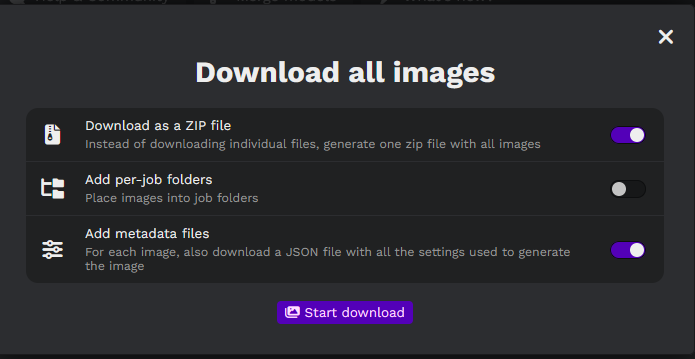

# <u>Stable diffusion archive view</u>

1.  Pour Initialiser le projet :

Supprimez :

- stable-diffusion-archive-view\\ main.json

- stable-diffusion-archive-view\SiteWeb\images\\.\*

2.  Paramètres d’exportation de Easy Diffusion

Il faut obtenir la figure 1:

- Cochez « Download as a ZIP file »

- Décochez « Add per-job folders »

- Cochez « Add metadata files »

Figure : Paramètres d’exportation de Easy Diffusion

3.  Mettre les Images téléchargées dans
    « stable-diffusion-archive-view\SiteWeb\images »

4.  Installer les packages nodeJs :

Commande : « npm install »

Résultat :

> npm install
>
> added 13 packages, and audited 14 packages in 6s
>
> found 0 vulnerabilities

5.  Créer la liste internet en locale

Commande : « npm start »

Résulta :

> npm start
>
> \> stable-diffusion-view@0.0.0 start
>
> \> node Make_SiteWeb.js
>
> Etape 1 : Listage des fichiers .JSON dans 'SiteWeb\images'
>
> Etape 2 : Analyse des fichiers .JSON dans 'SiteWeb\images'
>
> Etape 2.1 : Ajout dans la base de donnée du fichier
> 'a_photograph_of_an_astronaut_riding_a_horse_Seed-4621508_Steps-25_Guidance-7.5.3.json'
>
> Etape 2.1 : Ajout dans la base de donnée du fichier
> 'a_photograph_of_an_astronaut_riding_a_horse_Seed-5434601_Steps-25_Guidance-7.5.2.json'
>
> Etape 2.2 : Assignation de l'ID '00505' aux fichiers
> 'a_photograph_of_an_astronaut_riding_a_horse_Seed-5434601_Steps-25_Guidance-7.5.2'
>
> Etape 2.3 : Début du renommage des fichiers
>
> Etape 2.3 : Fin du renommage des fichiers
>
> Etape 2.4 : Début de la mise à jour de la base de données JSON
>
> Etape 2.4 : Fin de la mise à jour de la base de données JSON
>
> Etape 2.1 : Ajout dans la base de donnée du fichier
> 'a_photograph_of_an_astronaut_riding_a_horse_Seed-6510789_Steps-25_Guidance-7.5.1.json'
>
> Etape 2.2 : Assignation de l'ID '00506' aux fichiers
> 'a_photograph_of_an_astronaut_riding_a_horse_Seed-6510789_Steps-25_Guidance-7.5.1'
>
> Etape 2.3 : Début du renommage des fichiers
>
> Etape 2.3 : Fin du renommage des fichiers
>
> Etape 2.4 : Début de la mise à jour de la base de données JSON
>
> Etape 2.4 : Fin de la mise à jour de la base de données JSON
>
> Etape 3 : Début de la Sauvegarde de la base de données JSON
>
> Etape 3 : Fin de la Sauvegarde de la base de données JSON
>
> Etape 4 : Début de la Sauvegarde de 'index.html'
>
> Etape 4 : Fin de la Sauvegarde de 'index.html'
>
> Etape 5 : Début de la Sauvegarde de '%ID.html'
>
> Etape 5 : Fin de la Sauvegarde de '%ID.html'
